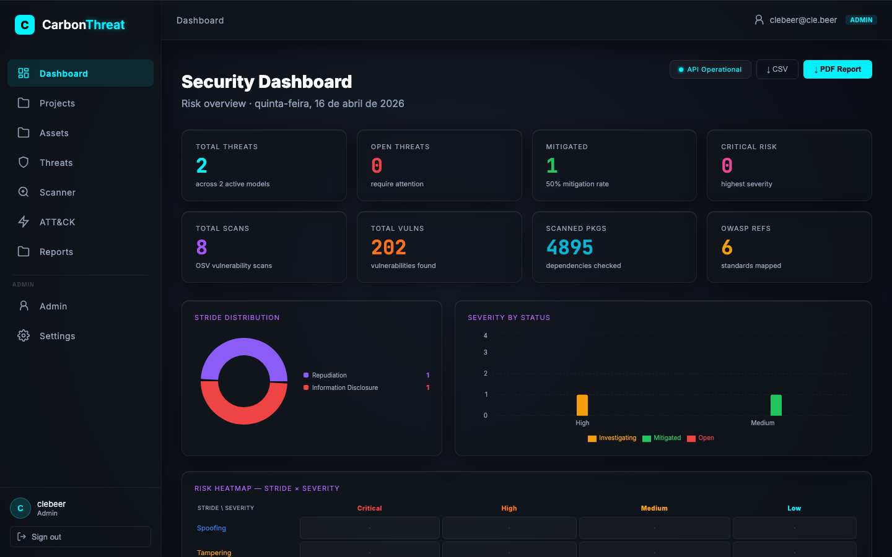
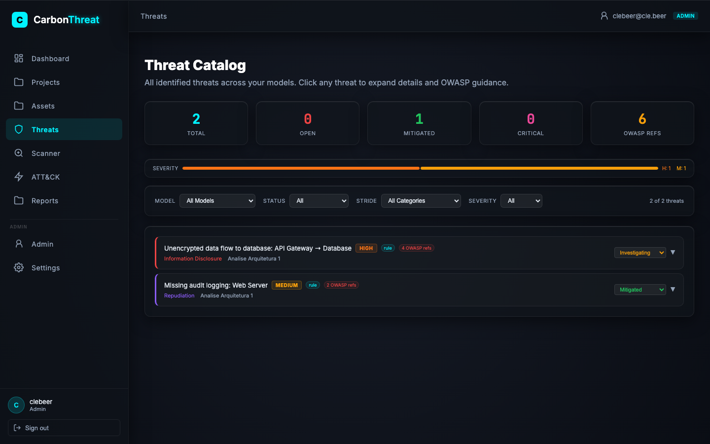
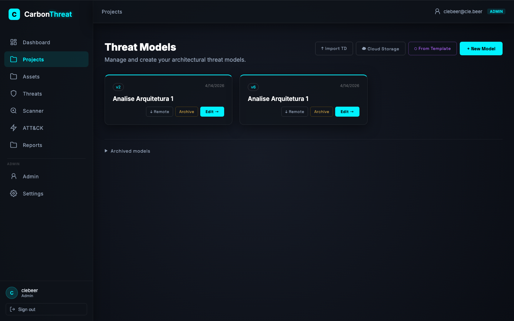
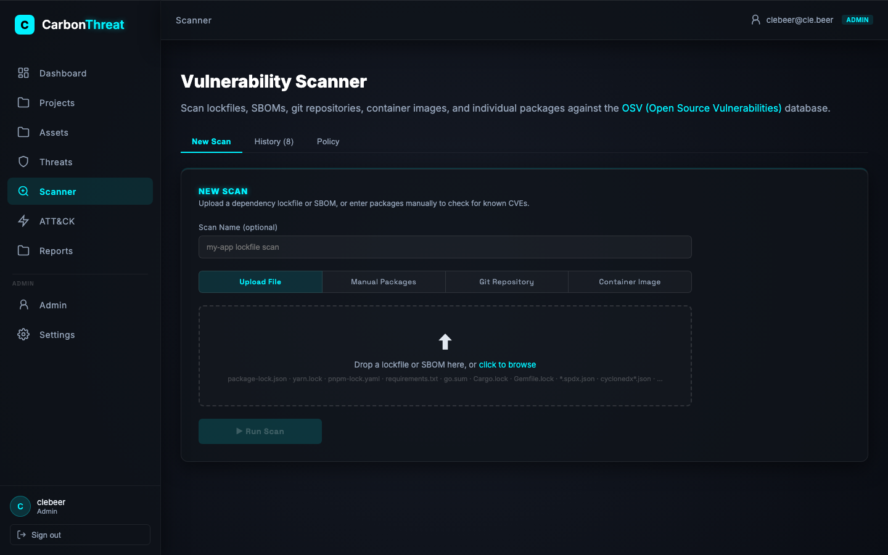
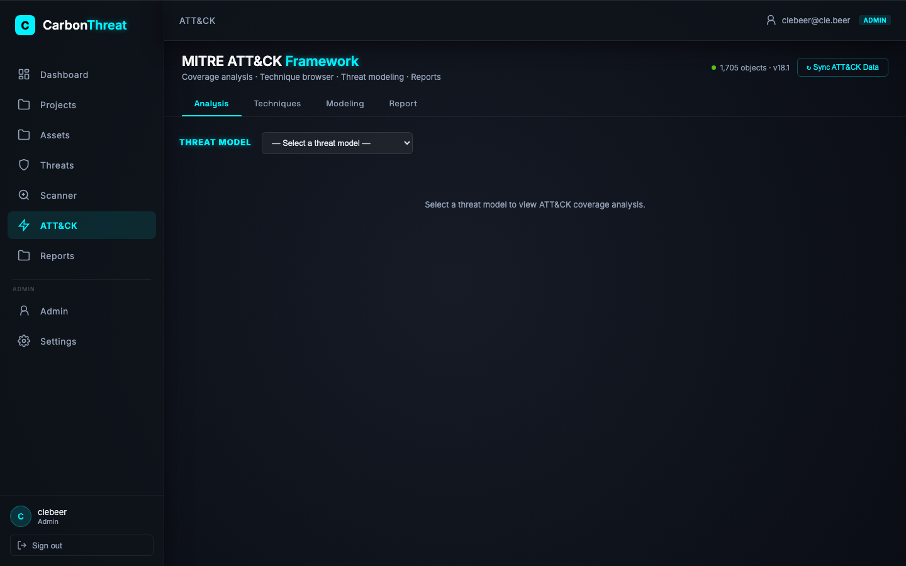
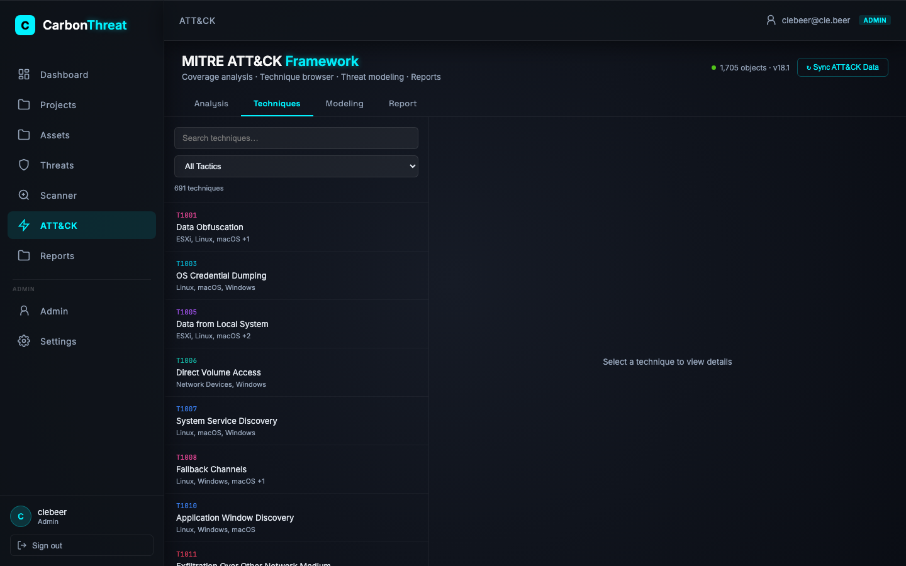
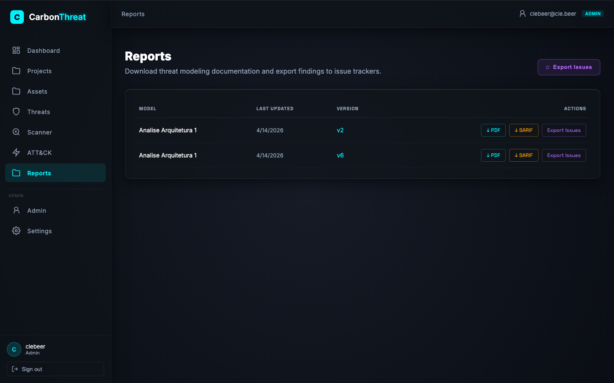

# CarbonThreat

Enterprise threat modeling platform — built on [OWASP Threat Dragon](https://owasp.org/www-project-threat-dragon/).

## Features

- Threat model creation with STRIDE/LINDDUN/CIA diagramming
- PostgreSQL-backed storage with encryption at rest (AES-256-GCM)
- Role-based access control (admin / analyst / viewer)
- AI-assisted threat suggestions (OpenAI or local Ollama)
- Vulnerability intelligence feed from [OSV](https://osv.dev) with STRIDE mapping
- **OSV Vulnerability Scanner** — scan lockfiles, SBOMs, git repos, and container images against the OSV database
- **MITRE ATT&CK Framework** — coverage analysis, technique browser, threat-to-technique mapping, and markdown/JSON reports
- Archive / restore / remote export of threat models
- Audit logging for all mutating operations
- SAML/SSO, OAuth (GitHub, GitLab, Bitbucket, Google), and local auth
- PDF and SARIF report export
- Issue tracker export (Jira, GitHub Issues, GitLab Issues)
- OpenAPI docs at `/api-docs`

## Screenshots

### Security Dashboard


### Threat Catalog


### Threat Models


### OSV Vulnerability Scanner


### MITRE ATT&CK — Coverage Analysis


### MITRE ATT&CK — Techniques Browser


### Reports


## Quick start (Docker)

```bash
git clone <repo-url> carbon-threat && cd carbon-threat
cp minimal.env .env                      # setup local environment
bash scripts/gen-local-certs.sh          # generate self-signed TLS cert
docker compose up --build -d
```

Open **https://localhost:3001** — the setup wizard runs on first visit.

**Default admin credentials (first run only):**

| Field | Value |
|---|---|
| Email | `admin@ct.ai` |
| Password | `CT_Admin@2026` |

> Change the password after first login: **Admin → Users → Edit**.

## Documentation

| Doc | Description |
|---|---|
| [docs/install/quickstart.md](docs/install/quickstart.md) | Docker production stack |
| [docs/install/configuration.md](docs/install/configuration.md) | Environment variables reference |
| [docs/install/wizard.md](docs/install/wizard.md) | Setup wizard and default admin |
| [docs/development/architecture.md](docs/development/architecture.md) | Backend architecture |
| [docs/development/api.md](docs/development/api.md) | API endpoints reference |
| [docs/development/schema.md](docs/development/schema.md) | Database schema |
| [docs/development/development.md](docs/development/development.md) | Local dev setup |

## Tech stack

| Layer | Technology |
|---|---|
| Backend | Node.js 20, Express, Native TLS, Knex, Babel |
| Frontend | React 18, Vite, TypeScript, React Query |
| Database | PostgreSQL 15 |
| Auth | JWT, Passport.js, SAML |

## License

[Apache 2.0](license.txt)
